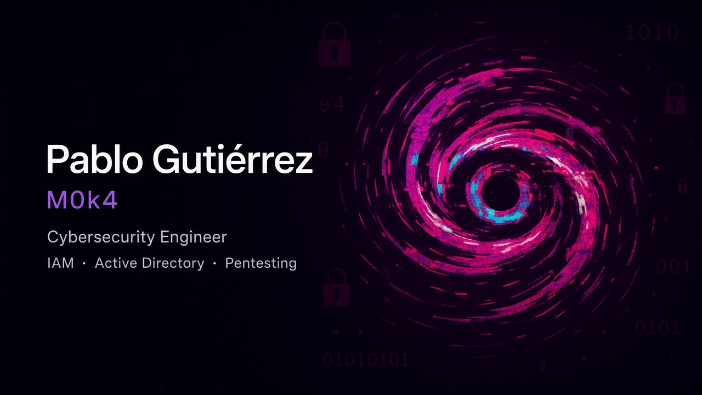
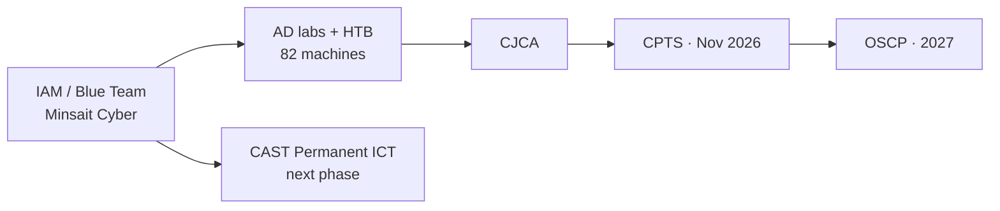

  

<h1 align="center">Pablo Gutiérrez</h1>

  <strong>M0k4</strong> · Cybersecurity Engineer at <strong>Indra | Minsait Cyber</strong> 
  IAM and security automation · transitioning to pentesting · Brussels

  
  
  
  

  
  
  
  
  
  

  

---

## Now

Cybersecurity engineer working on **identity, access governance, and security automation** at Minsait Cyber (Indra). Offensive practice is public: Hack The Box machines and OSCP-oriented write-ups under **M0k4**. Successful EPSO CAST Permanent candidate for **Information and Communication Technologies** — passed the reasoning tests, next phase is recruitment by EU institutions for ICT contract staff.

<table>
  <tr>
    <td width="50%" valign="top">

**This year**
- IAM / Databricks security at Minsait Cyber
- Custom permission graphing for Databricks (Neo4j / PyVis)
- HTB write-ups, OSCP-oriented, no flags
- CAST Permanent ICT — next recruitment phase

    </td>
    <td width="50%" valign="top">

**Next**
- CPTS exam · **5 Nov 2026**
- OSCP · **2027** (after CPTS)
- EU institutions · ICT contract staff
- More Active Directory attack-path write-ups

    </td>
  </tr>
</table>

> CAST Permanent — ICT (`EPSO/CAST/P/17/2017`). Reasoning tests passed in August 2026. This qualifies me for the next phase of recruitment, not for an automatic job offer.

---

## Practice

  

Write-ups live in [Pablogb29/HackTheBox](https://github.com/Pablogb29/HackTheBox). Methodology, tooling, and mitigations — **no flags**.

| Machine | Level | Focus | Write-up |
| --- | --- | --- | --- |
| [Administrator](https://github.com/Pablogb29/HackTheBox/blob/main/Machines/MEDIUM/Administrator.md) | Medium | Windows / AD | [Open](https://github.com/Pablogb29/HackTheBox/blob/main/Machines/MEDIUM/Administrator.md) |
| [Certified](https://github.com/Pablogb29/HackTheBox/blob/main/Machines/MEDIUM/Certified/README.md) | Medium | Windows / AD | [Open](https://github.com/Pablogb29/HackTheBox/blob/main/Machines/MEDIUM/Certified/README.md) |
| [Interpreter](https://github.com/Pablogb29/HackTheBox/blob/main/Machines/MEDIUM/Interpreter/README.md) | Medium | Linux | [Open](https://github.com/Pablogb29/HackTheBox/blob/main/Machines/MEDIUM/Interpreter/README.md) |
| [EscapeTwo](https://github.com/Pablogb29/HackTheBox/blob/main/Machines/EASY/EscapeTwo/README.md) | Easy | Windows / AD | [Open](https://github.com/Pablogb29/HackTheBox/blob/main/Machines/EASY/EscapeTwo/README.md) |
| [Cicada](https://github.com/Pablogb29/HackTheBox/blob/main/Machines/EASY/Cicada/README.md) | Easy | Windows / AD | [Open](https://github.com/Pablogb29/HackTheBox/blob/main/Machines/EASY/Cicada/README.md) |
| [Support](https://github.com/Pablogb29/HackTheBox/blob/main/Machines/EASY/Support/README.md) | Easy | Windows / AD | [Open](https://github.com/Pablogb29/HackTheBox/blob/main/Machines/EASY/Support/README.md) |

---

## Path

| Credential | Status |
| --- | --- |
| CJCA — Hack The Box | Completed |
| CAST Permanent ICT — EPSO | Successful · Aug 2026 |
| CPTS — Hack The Box | Exam booked · 5 Nov 2026 |
| OSCP — Offensive Security | Planned · 2027 |

Education: MSc Cybersecurity (Deloitte / IMF) · MSc Artificial Intelligence (IUNIT) · BEng Electronic Telecommunications (UAB). Diplomas on [pabloinfosec.com](https://www.pabloinfosec.com).

---

## Stack I actually use

Not a tool dump — the stack that shows up in work and write-ups.

| Identity & cloud | Offensive practice | Engineering |
| --- | --- | --- |
| Azure IAM · Databricks SCIM | Linux / Windows internals | Python · SQL |
| AWS security · ENS / ISO 27001 | Active Directory · BloodHound | Bash · PowerShell |
| Neo4j + PyVis graphs | Nmap · Burp · AD attack paths | Git · Docker |

  

---

## GitHub

  
  

  

  

---

## Start here

1. [pabloinfosec.com](https://www.pabloinfosec.com) — role, experience, diplomas, CAST letter, CJCA
2. [HackTheBox write-ups](https://github.com/Pablogb29/HackTheBox) — methodology, no flags
3. [Web portfolio 2026](https://github.com/Pablogb29/Webportfolio_2026) — this site
4. [Hack The Box profile](https://app.hackthebox.com/users/1583498)
